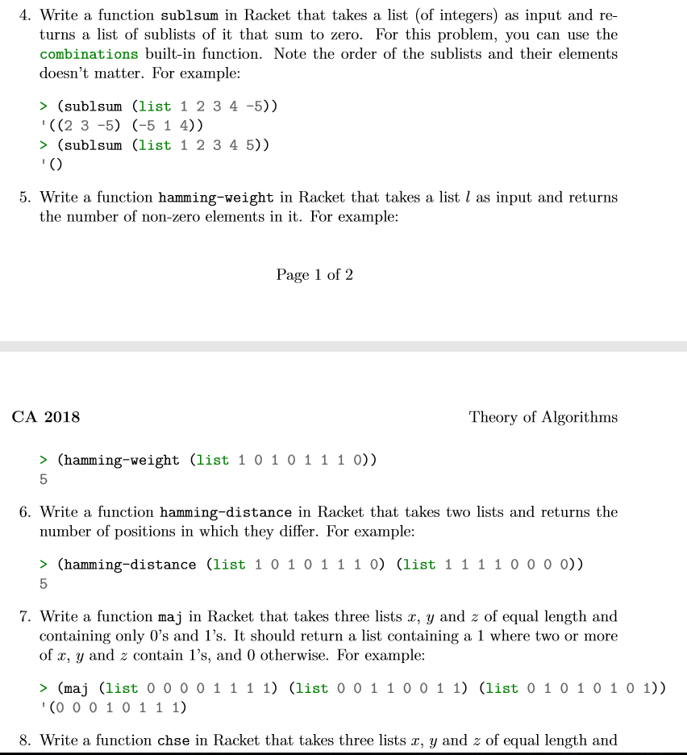
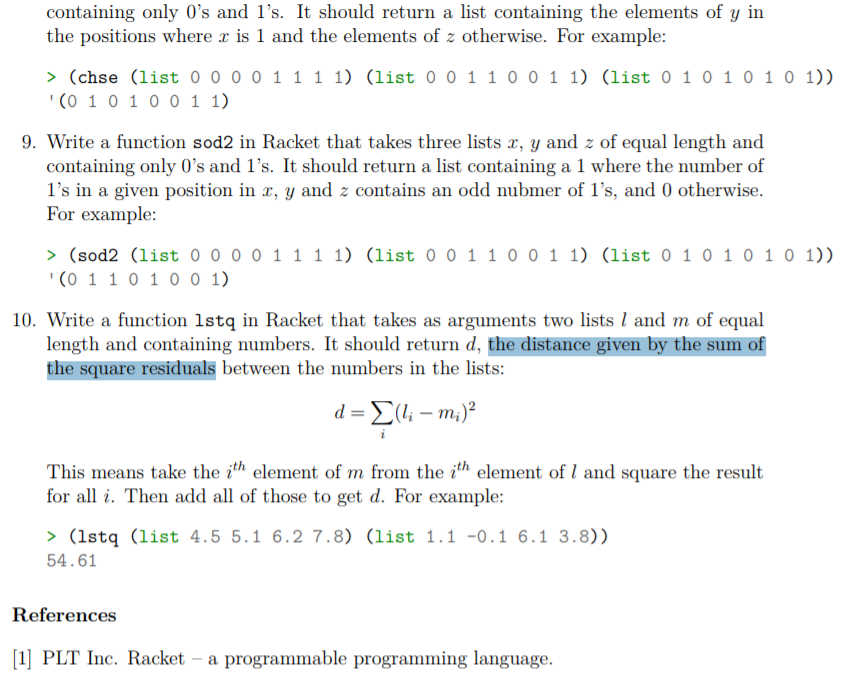

# TheoryOfAlgorithmsProgrammingTasks
Programming Tasks to be completed as part of course Grade. These Programming Tasks are written in Racket using functional programming.

## What is Functional Programming

Functional programming (often abbreviated FP) is the process of building software by composing pure functions, avoiding shared state, mutable data, and side-effects. Functional programming is declarative rather than imperative, and application state flows through pure functions. Contrast with object oriented programming, where application state is usually shared and colocated with methods in objects.

## What is Racket

Racket is a general purpose programming language derived from Lisp. It is referred to as a "programmable programming language" because its built-in macro system is so powerful that it allows a programmer to redefine everything about the language itself. For this reason, Racket is often used to design and implement custom programming languages for specific project needs.

Racket was originally developed as part of the PLT ("Programming Language Team") project by computer scientist Matthias Felleisen in the 1995. His intention was to create a language which would help novice programmers learn more about the potential of computers.

## How to install DrRacket and use my solutions

DrRacket is a graphical environment for developing programs using the Racket programming languages.

### How to Install:

* Click the following [Link](https://download.racket-lang.org/) to install and follow the instruction.

* If you type DrRacket into your computer search bar you will find the DrRacket Programming enviroment.

* To use my solutions download my repo at https://github.com/gerardnaughton7/TheoryOfAlgorithmsProgrammingTasks and open my .rkt files in Dr Racket and press Crtl r to run the solution. 

## Here is our List of Tasks from our Lecturer Ian McLoughlin

## References

https://www.computerhope.com/jargon/r/racket.html

https://docs.racket-lang.org/drracket/index.html

https://medium.com/javascript-scene/master-the-javascript-interview-what-is-functional-programming-7f218c68b3a0