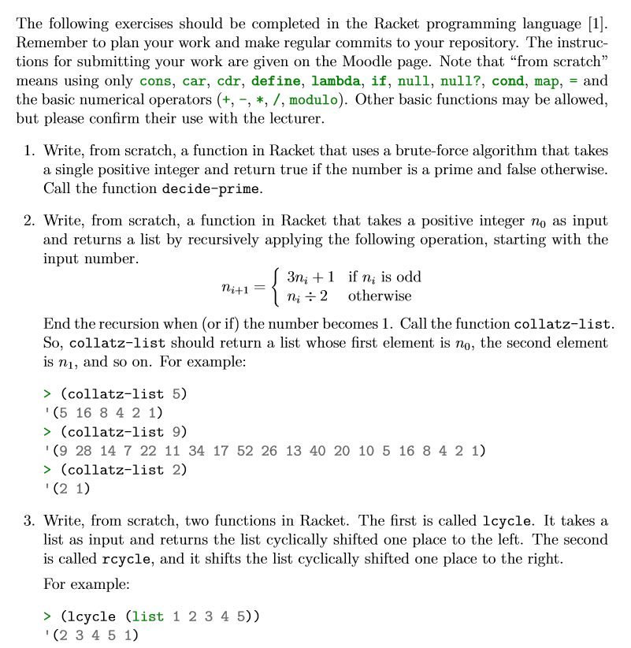

# TheoryOfAlgorithmsProgrammingTasks
Programming Tasks to be completed as part of course Grade. These Programming Tasks are written in Racket using functional programming.

## Here is our List of Tasks from out Lecturer Ian McLoughlin

