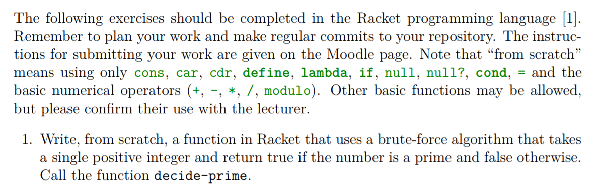

# Task 1 Decide-prime

## Decide Prime

## Objective
Provided from our Lecturer Ian Mcloughlin

<p></p>

## Algorithm

First we should as what is a prime number?

A prime number is a number that is divisible only by itself and 1.
As asked we were told to use brute force. So in order to fulfil this i decided to divide the number given by every number between 2 and itself. If the answer returned was a whole number/integer it would prove it was not a prime and we would stop and return the answer as false. However if all answers were not whole numbers it would prove that this number can only be divisible by itself and 1 and we would return true.

## Solution

```
(define (decide-prime? x) ; function called decide-prime as specified
    (not
        (for/or [(i (in-range 2 x))] 
            (integer? (/ x i))))) 
```

## Conclusion

I found this task a could introduction to Racket and functional programming. I do enjoy maths and this requires me to think in a very different way to the usual norms when confronting math problems.

## References

https://en.wikipedia.org/wiki/Primality_test