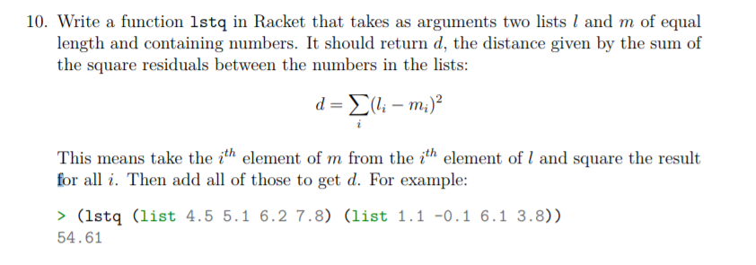

# Task 10 lstq

## Objective
Provided from our Lecturer Ian Mcloughlin

<p></p>


## Algorithm

For this task, we were asked to create a function called lstq. This will involve taking in 2 lists of equal length and adding all the results of squaring the value gotten from taking the element in one list from a element in the second list which are at matching positions. 

lstq:
From following the example given to us by our lecturer, inputed lists to the function would be of equal size and take varied numerical inputs including decimal number(doubles, floats).

Firstly i start off with making a simple square function. which i will then call in my lstq function. This function simply takes in a value x and multiplies the x value by itself and returns the answer. ie (x*x)

In my lstq function we then take in the 2 list x and y. I then check to see if list x is null at the start. If list x is null i return zero/0. If list x is not null i then Add the result of squaring the car x - car y(car = takes the first element of a list) to the recursion call of lstq function of cdr of x and y(cdr = gives the list minus the first element). When the list is finally null it should return the sum. 

## Solution

The task10.rkt file contains comments on this code

```
; square function 
(define (square x)
  (* x x )
)
   
; lstq function
(define (lstq x y)
  (if(null? x)
  0
  (+ (square(- (car x) (car y))) (lstq (cdr x) (cdr y)))
  )                                                     
)  

```
## Conclusion

After wrapping my head around the math and breaking it down into sections such as (take away the 2 elements that are at matching positions in list x and y) (Square the result. Multiply the result by its self) and then eventually repeating this to the rest of the remaining lists and adding them all together. I found the easiest way to implement it was to have a seperate square function which kept the code tidy. 
This type of function would be used in statistics to see how well your model fits your data. The smaller residual sum the better the model fits your data.  


## References

http://www.statisticshowto.com/residual-sum-squares/
