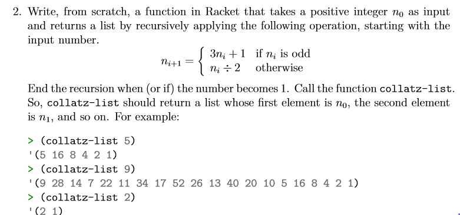
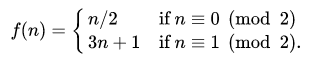

# Task 2 Collatz-list

## Objective
Provided from our Lecturer Ian Mcloughlin

<p></p>

## Algorithm

Collatz conjecture in mathamatics concerns a sequence defined as follows:

* Start with any positive integer n
* if n is positive divide n by 2
* if n is negative multiply n by 3 and add 1
* repeat this sequence until n becomes 1

The conjecture is that no matter what value n is the sequence will always reach 1.

Here is the function:

<p></p>

## Solution

```
(define (collatz-list n);
  (if (= n 1)
      (cons n true)
      (cons n(if (integer? (/ n 2)
          (collatz-list (/ n 2))
          (collatz-list (+ 1 (* n 3)))))
      )
  )

```

## Conclusion

This is the first task where we used recursion and we can see how very powerful it is. We will be using this alot in the future tasks.

## References

https://en.wikipedia.org/wiki/Collatz_conjecture