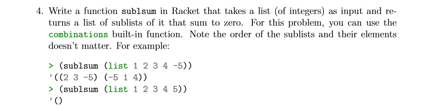

# Task 3 Shifting lists Cyclically

## Objective
Provided from our Lecturer Ian Mcloughlin

<p></p>

## Algorithm

For this task, we are to get each possible sublist combinations of the list we pass into our sub1sum function and check if its contents sums to 0. Luckily we could use the built in combinations function in racket. 

Once i passed in the list i would loop over each sublist provided by the combinations function. For every sublist i would add all elements together using myAdd function. And if there result was equal to 0 i would display this sublist. 

## Solution

Code, the task4.rkt file contains comments 

```
; myAdd function
(define (myAdd l)
  (if(not(null? l))
  (for/sum ((i l))
    i)
  1
  ))

;sub1sum function
(define (sub1sum l)
  (for ([e (in-list (combinations l) )])
    (if(= 0 (myAdd e))
       (displayln e)
       '())))

```
## Conclusion

Once reading over the docs in Racket.lang.org on combinations i was ready to tackle this task. I found this Task alot easier than the previous Task3 but this was most likely because i did not have to generate my own combinations function from scratch.

## References

https://docs.racket-lang.org/reference/pairs.html
