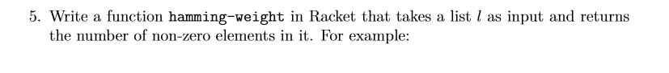

# Task 5 Hamming-Weight

## Objective
Provided from our Lecturer Ian Mcloughlin

<p></p>
<p></p>

## Algorithm

For this task, we were asked to get the hamming-weight of a list. Find all elements of the list that are not zero.

Hamming-weight:
For this function i concentrated on the fact that we are usually calculating the hamming-weight at bit level and only dealing with list of 1 and 0s . So i decided to recurse through the list and simply add all the elements.

Hamming-weight2
From reviewing the question asked and because it was kind of vague i created a second function which would check for all zero elements and out put the number of non-zero elements. 

## Solution

Code, the task5.rkt file contains comments for this code

```

;hamming-weight function
(define (hamming-weight l)
  (if(null? l)
   0
  (+ (car l) (hamming-weight (cdr l)))
  )
)

;Hammin-weight2 function
(define (hamming-weight2 l)
  (if(null? l)
   0
  (if(= (car l) 0)
        (hamming-weight2 (cdr l))
        (+ 1 (hamming-weight2 (cdr l)))
        )
  )
)

```
## Conclusion

Was interesting to read up on how these mathamatical function/algorithms(Hamming-weight(1954)) dating back to 1899 are still in the back bone of everyday computing. The hamming-weight being used in particular for information theory, coding theory and cryptography. Was also a learning curve on knowing what questions to ask.

## References

https://en.wikipedia.org/wiki/Hamming_weight

