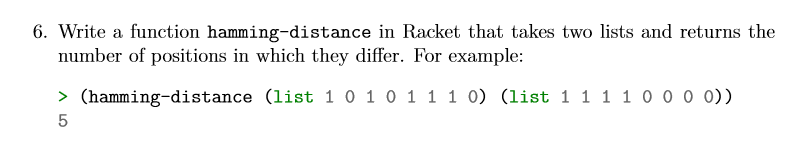

# Task 6 Hamming-Distance

## Objective
Provided from our Lecturer Ian Mcloughlin

<p></p>


## Algorithm

For this task, we were asked to get the hamming-weight of a list. Find all elements of the list that are not zero. I created 2 function hamming-weight and hamming-weight2. 

Hamming-weight:
Because the hamming-weight deals with

To keep track the counter. I used a module which allowed me to gain access to the counter. Using mutator functions increment and reset to modify the counter.

## Solution

Code, the task5.rkt file contains comments for this code

```
;module m
(module m racket
    (provide counter increment! reset!)
    (define counter 0)
    (define (increment!)
      (set! counter (add1 counter))
      )
    (define (reset!)
      (set! counter 0))
  )
  
(require 'm)

;Hamming-weight function 
(define (hamming-weight l)
  (for ([e (in-list l)])
    (if(not(= 0 e))
      (increment!)
       '()))
  (displayln counter)
  (reset!)
  )

;Hamming-weight2 function
(define (hamming-weight2 l)
  (if(not(null? l))
     (cond
       [(not(= 0 (car l))) (increment!)]
       )
     '())
  (if(null? (cdr l))
   (displayln counter)
   (hamming-weight2 (cdr l)))
  (reset!);
  )

```
## Conclusion

Was interesting to read up on how these mathamatical function/algorithms(Hamming-weight(1954)) dating back to 1899 are still in the back bone of everyday computing. The hamming-weight being used in particular for information theory, coding theory and cryptography.

## References

https://en.wikipedia.org/wiki/Hamming_weight

https://docs.racket-lang.org/guide/module-set.html