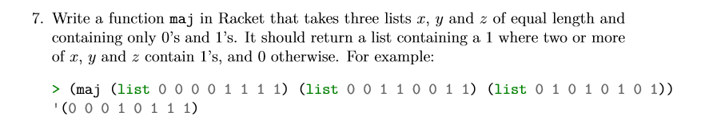

# Task 7 maj

## Objective
Provided from our Lecturer Ian Mcloughlin

<p></p>


## Algorithm

For this task, we were asked to create a function called maj, that takes 3 equal length lists containing 1s and 0s. Our function will then compare each element of each list at the same position and return a list conatining the majority number in each position.  

Maj:
From following the example given to us by our lecturer, inputed lists to the function would be of equal size. 
In my function presuming that all lists are of same size (Step1) i check to see if one of the lists was null at the start. if null i return 0 and if not i do another (step2) if statement and check the car(first element) of the first 2 lists and see if they are the same. If equal i (step3) cons(place element into new list) the first element of list 1 and cons it to the result of calling the maj function on the remaining list( the cdr of the remain 3 lists). Allowing recursion. If they do not match i do another (step4) if statement and check if the car(first element) of the 1st and 3rd lists are equal. If they are equal i repeat step3. If they do not match i repeat step 3 once again except i cons the car(first element) of the 3rd list to the function call of maj. 
Once list 1 reaches null it should return a list of elements containing the majority element in each position for the 3 lists.

## Solution

Code, the task7.rkt file contains comments for this code

```
;maj function
(define (maj x y z)
  (if(null? x)
   '()
   (if(= (car x) (car y))
        (cons (car x) (maj (cdr x) (cdr y) (cdr z)))
        (if(= (car x) (car z))
           (cons (car x) (maj (cdr x) (cdr y) (cdr z)))
           (cons (car z) (maj (cdr x) (cdr y) (cdr z)))
        )
   )
 )
)

```
## Conclusion

Took me a while to figure out which elements would need to be checked to figure out what was the majority element would be but realising that there was only 3 lists and 2 types(0 and 1). I figured out it would only take 2 if statements.


## References

https://github.com/theory-of-algorithms/problems-scheme
