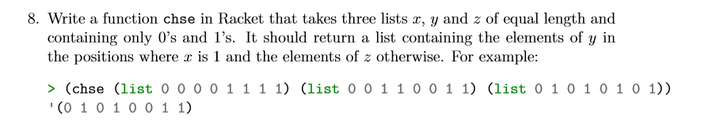

# Task 8 chse

## Objective
Provided from our Lecturer Ian Mcloughlin

<p></p>


## Algorithm

For this task, we were asked to create a function called chse, that takes 3 equal length lists containing 1s and 0s. Our function will then check each element in x to see if it is equal to either 1 or 0. if it is equal to 1 we will enter the corresponding element we are checking to the element in y and place that element into our new list. if it is not equal to 1 we will enter the corresponding element we are checking to the element in z and place that element into our new list. And then finally output the resulting list. 

Chse:
From following the example given to us by our lecturer, inputed lists to the function would be of equal size and made up of 1s and 0s. 
In my function we take in the 3 list x y and z. I then check to see if list x is null at the start. if null i return 0 and if not i do another if statement and check if the first element(car x) in x is equal to 1. If it is i get the first element in y(car y) using the cons function and cons it to the result of calling the chse function on the cdr(list minus the first element) of the 3 lists. If it does not equal 1 I get the first element in z(car z) using the cons function and cons it to the result of calling the chse function on the cdr(list minus the first element) of the 3 lists. 
Once list x reaches null it should return a list of elements containing the y and z elements in there correct positions..

## Solution

```
;chse function
(define (chse x y z)
  (if(null? x)
   '()
   (if(= (car x) 1)
        (cons (car y) (chse (cdr x) (cdr y) (cdr z)))
        (cons (car z) (chse (cdr x) (cdr y) (cdr z)))
   )
 )
)

```
## Conclusion

After completing task 7 i found this task very easy and only needed to slightly modify the maj function i previously made.


## References

https://github.com/theory-of-algorithms/problems-scheme
