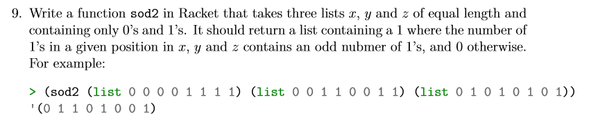

# Task 9 sod2

## Objective
Provided from our Lecturer Ian Mcloughlin

<p></p>


## Algorithm

For this task, we were asked to create a function called sod2, this will involve taking in 3 lists of equal length, consisting of 1s and 0s and check at each specific position of each list if there is an odd numbers of 1s between the 3 lists. If there is a odd number of 1s we input a 1 into a new list and if they are not odd we will input a 0 into the new list.

I created 2 functions for the this Task sod2 and sod22.

sod2:
From following the example given to us by our lecturer, inputed lists to the function would be of equal size and made up of 1s and 0s. 
In my function we take in the 3 list x y and z. I then check to see if list x is null at the start. if null i return a empty list and if not i do another if statement which will check if all the first elements of x y and z are = 1 or (x = 1 and y, z = 0) or (y = 1 and x, z = 0) or (z = 1 and x, y = 0). if any of these conditions are true, I cons a 1 to the result of a recursion call of sod2 on the cdr(list minus the first element) of x y and z. if they are all false I cons a 0 to the result of a recursion call of sod2 on the cdr(list minus the first element) of x y and z. 
Once list x reaches null it should return the resulting list.

sod22:
My sod22 function is quite similar to my first function but rather than checking the all the possible outcomes where 1 will be odd, i check the modulo 2 of the sum of all the first elements in the lists x y and z and see if its = 0. If = 0 cons a 0 to the result of a recursion call of sod22 on the cdr(list minus the first element) of x y and z. if they are all false I cons a 1 to the result of a recursion call of sod22 on the cdr(list minus the first element) of x y and z. Once list x reaches null it should return the resulting list.   
## Solution

The task9.rkt file contains comments on this code

```
; sod2 function
(define (sod2 x y z)
  (if(null? x)
  '()
  (if (or (= 1 (car x) (car y) (car z))
          (and (= 1 (car x)) (= 0 (car y) (car z)))
          (and (= 1 (car y)) (= 0 (car x) (car z)))
          (and (= 1 (car z)) (= 0 (car y) (car x))) )
     (cons 1 (sod2 (cdr x) (cdr y) (cdr z)))
     (cons 0 (sod2 (cdr x) (cdr y) (cdr z)))
  )
  )
)  

; sod22 function
(define (sod22 x y z)
  (if(null? x)
  '()
  (if(= 0 (modulo (+(car x) (car y) (car z))2))
     (cons 1 (sod22 (cdr x) (cdr y) (cdr z)))
     (cons 0 (sod22 (cdr x) (cdr y) (cdr z)))
  )
  )
)  

```
## Conclusion

Took me a while to understand how to implement the "and" and "or" statement but once i got past this and figured out the 4 conditions where the number of 1 would be odd it quickly came together. 


## References

https://stackoverflow.com/questions/1576288/scheme-how-to-test-2-conditions-in-one-clause

https://docs.racket-lang.org/reference/if.html
